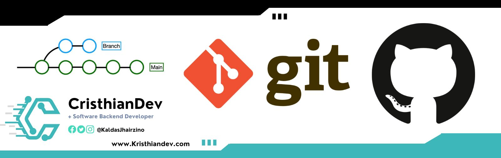

# Git & GitHub

## Taller para aprender Git & GitHub desde cero

#### Clase 1: 11/02/2023

- Introducción
- ¿Qué es Git?
- Instalación
- Comandos básicos de la terminal: ls, cd, mkdir
- Herramientas gráficas Git & GitHub: GitHub Desktop, GitKraken, Sourcetree
- Configuración de Git
- Configuración SSH GitHub
- Conceptos Repositorio, Rama
- Trabajar con ramas: git branch, merge
- Crear repositorio local
- Comandos de Git: init, status, add, commit, log, checkout, push, fetch, pull, clone
- Colaboración en GitHub: resolución de conflictos en pull request y sincronización de repositorios
- Crear repositorio GitHub.
- Cómo ignorar archivos con .gitignore
- Markdown

## Enlaces de interés

- [Web](https://git-scm.com) oficial Git.
- [Video Freecodecamp](https://www.youtube.com/watch?v=mBYSUUnMt9M)
- [Guía](https://training.github.com/downloads/es_ES/github-git-cheat-sheet/) con comandos de Git más utilizados.
- [Web](https://github.com) GitHub.
- [Documentación](https://docs.github.com/es) GitHub.
- [Configuración](https://docs.github.com/es/authentication/connecting-to-github-with-ssh/about-ssh) SSH.
- [Markdown](https://docs.github.com/es/get-started/writing-on-github/getting-started-with-writing-and-formatting-on-github/basic-writing-and-formatting-syntax)
- [Readme](https://readme.so/editor)
- [Gitignore](https://www.toptal.com/developers/gitignore)

#### Puedes apoyar mi trabajo haciendo "☆ Star" en el repo o nominarme a "GitHub Star". ¡Gracias!

Cualquier consulta o duda me puedes encontrar en:

##  Hola, mi nombre es Cristhian.

### Software Engineer - Backend Developer

Hola , Mi nombre es Cristhian soy un entusiasta de las TI, apasionado por las últimas tecnologías desde una perspectiva de investigación.
Me encanta mucho las tecnologías nuevas e interesantes que ayudan a la sociedad a encontrar una solución a un problema existente.

### En mi perfil de GitHub puedes encontrar mas información

